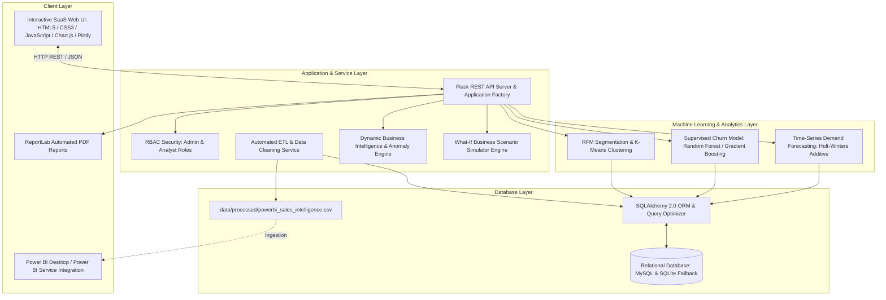
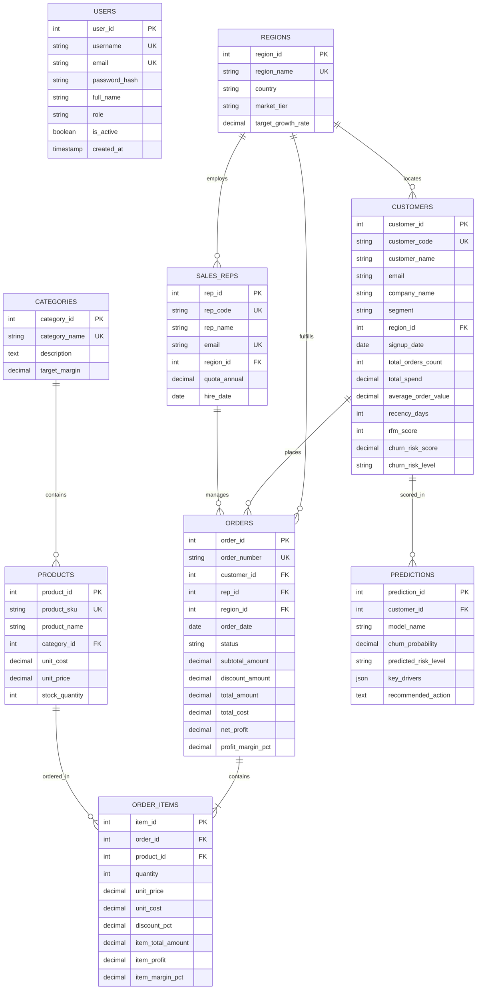

# System Architecture & Diagrams Specification

## 1. High-Level System Architecture Diagram

---

## 2. Entity-Relationship (ER) Relational Schema Diagram

---

## 3. Data Flow Diagram (DFD Level 1)

```mermaid
graph LR
    Source[CSV / Transaction Upload] -->|Raw Records| Cleaner[Data Cleaner Module]
    Cleaner -->|Validation & Deduplication| Staging[Cleaned DataFrame]
    Staging -->|Bulk Insert| DB[(Relational DB)]
    DB --> Aggs[RFM & Metrics Aggregator]
    Aggs --> ML[Churn & Forecast Models]
    ML --> Cache[Model Cache & DB Predictions]
    Cache --> API[Flask REST APIs]
    API --> Client[Interactive Web Dashboard]
```

